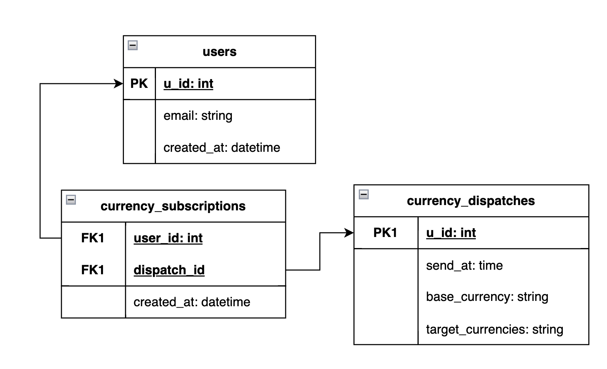
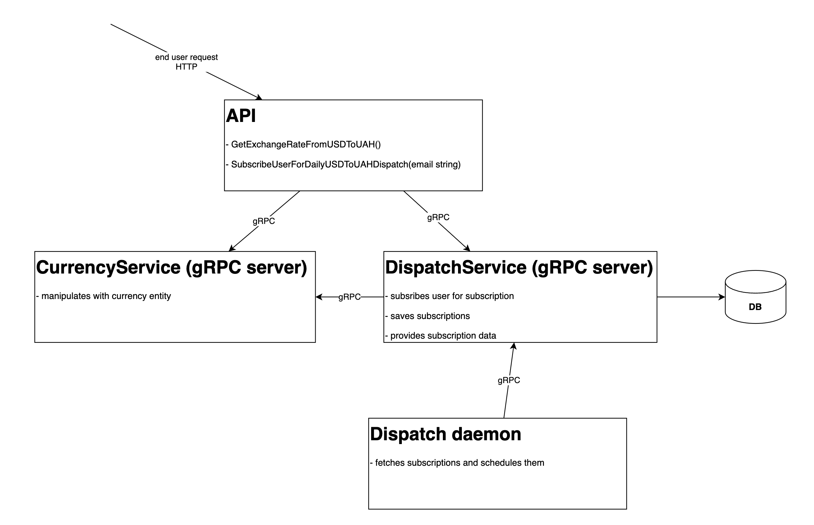

# Subscription API

API allows:
- find out current exchange rate of USD in UAH
- subscribe email address to currency rate change dispatch

## Used technologies

- __Go__ as main language.
- __gin__ as web framework.
- __PostgreSQL__ as main storage.
- __gRPC__ for inter-service communication.
- __[ExchangeRate-API](https://www.exchangerate-api.com/)__ for currency rate info.

## Quick start

1. Get API key from [third-API](https://app.exchangerate-api.com/) and set `EXCHANGE_CURRENCY_API_KEY` value in `docker/default.env`.
2. Run `make start`.

## ER diagram

1. User can subscribe for one or more dispatches.
2. User has own table in case there will need to save more data about him.
3. Dispatch specifies when to send it and what to send in it.
4. Zero, one or more users can be subscribers of same dispatch.
5. Dispatch is related to currency, but it is possible that in the future there will be \
another type of dispatch.
6. Subscription specifies when to 

I assumed that each user can have multiple subscriptions and multiple users can be subscribed\
to one dispatch (many-to-many relationship).

There is no information about ability to customize time of dispatch sending \
(just period - once a day), so I set it default for all subscribers, based on KISS. \
But it is possible to customize it later if there will be necessity.

## Architecture

### Processes

Keeping in mind _12-factor APP_ methodology I decided to split app functionality into \
4 separate processes:

1. ___API___ is an entry point for external users of `SubscriptionAPI`. It is web server and\
makes requests to services for required functionality. For now it allows 
2. ___CurrencyService___ is responsible for fetching currency rates from third-party API. \
In perspective as business requirements grow it will save rates in some store or \
calculate/agregate currency-related data.

3. ___DispatchService___ is responsible for subscribing users to dispatches, \
sending of dispatches thorough SMTP server to subscribers, and getting info about dispatch.\
In perspective it would be able to create dispatches, change dispatches, \
customize subscriptions etc.

4. __DispatchDaemon__ (is not implemented for now) is automatic process that periodically \
gets info about dispatches and invokes dispatch sending.

## Tests
There are implemented unit tests for some business logic. In perspective I will cover \
all business logic with unit and sunctional tests.

## TODO
1. Implement dispatch daemon
2. Implement sending of dispatches to subscribers.
3. to be continued...
